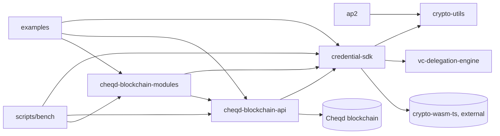

# Project Overview

`sdk` (npm scope `@docknetwork`) is Dock's open-source Verifiable Credentials SDK: JavaScript/TypeScript
libraries for credential management, DID resolution, cryptography (Ed25519, secp256k1/r1, BBS+,
KVAC/accumulators), and blockchain-backed storage, currently targeting the Cheqd network (Dock's own
chain is being sunset — see `README.md`). It is a Yarn-workspaces monorepo orchestrated by Turbo
(`turbo.json`), pinned to `yarn@1.22.22` via `packageManager` in the root `package.json`. Each package
under `packages/*` is published independently to npm; versioning and changelogs are managed with
Changesets (`.changeset/config.json`, root `publish-packages` script, `.github/workflows/npm-publish.yml`).

## Repository Structure

- `packages/` — the published libraries; see the table below.
- `examples/` — runnable usage examples (`@docknetwork/sdk-examples`, private, not published) exercised
  in CI against a real Cheqd node.
- `scripts/bench/` — benchmark harness (`@docknetwork/benchmarks`, private) for perf-testing the
  blockchain modules.
- `scripts/` — shell helpers for local/CI blockchain nodes (`with_cheqd_docker_test_node`,
  `run_cheqd_node_in_docker`, `with_dock_docker_test_node`, etc.) and `check-licenses.sh`. The
  `scripts/migration` workspace is declared in root `package.json` `workspaces` but does not currently
  exist on disk — a `yarn install` will simply skip it.
- `tutorials/` — an mdBook source tree, built by the `mdbook` root script and deployed by
  `.github/workflows/docs.yml`.

## Packages

| Package | Purpose |
|---|---|
| `@docknetwork/credential-sdk` | API-agnostic core: VC/VP types, DIDs, claim deduction, resolvers, crypto abstractions. Depends on `crypto-utils`, `crypto-wasm-ts`, and `vc-delegation-engine`. |
| `@docknetwork/cheqd-blockchain-api` | Low-level client atop `@cheqd/sdk` for talking to the Cheqd chain (DIDs, resources, wallet, multi-sender). Depends on `credential-sdk`. |
| `@docknetwork/cheqd-blockchain-modules` | Cheqd-specific implementations of `credential-sdk`'s abstract modules (DID, accumulator, attest, blob, status-list, offchain-signatures). Depends on `credential-sdk` and `cheqd-blockchain-api`. |
| `@docknetwork/crypto-utils` | Standalone keypair/signature/byte-utility primitives shared by the other packages. No internal dependencies. |
| `@docknetwork/vc-delegation-engine` | Evaluates delegated-credential chains in VPs and feeds Cedar policy decisions. No internal dependencies; peer-depends on `@cedar-policy/cedar-wasm`. |
| `@docknetwork/ap2` | AP2 mandate/receipt issuance and verification (compact SD-JWTs). Depends on `crypto-utils`. |

Check each package's own `package.json` for its current version — versions are managed by Changesets and
move independently of this document.

## Build & Development Commands

```bash
# Install (root; runs across all workspaces)
yarn install

# Build / test / lint (Turbo-orchestrated, filterable per package)
npx turbo run build
npx turbo run test
npx turbo run lint --parallel
npx turbo run docs --parallel        # per-package jsdoc -> each package's out/reference
yarn mdbook                          # tutorials/ -> out/tutorials (mdBook)

# Scope to one package, e.g.:
npx turbo run test --filter @docknetwork/credential-sdk
npx turbo run build --filter @docknetwork/cheqd-blockchain-api

# Tests that require a live Cheqd node (CI sets CHEQD_MNEMONIC/CHEQD_IMAGE_TAG/CHEQD_NETWORK)
npx turbo run test-with-node --filter @docknetwork/cheqd-blockchain-api
npx turbo run examples-with-node

# Release (Changesets; see .changeset/config.json)
yarn publish-packages          # changeset version && changeset publish
```

Node/Yarn versions: `engines`/`packageManager` in the root `package.json`; most packages also declare
their own `engines.node` (currently `>=22.0.0`) — check the package's own `package.json` if in doubt.
`vc-delegation-engine` is the exception: it declares no `engines` field at all.

## Code Style & Conventions

- **Linting:** a single root ESLint config (`.eslintrc.json`, `root: true`) extends `airbnb-base`,
  `eslint:recommended`, `plugin:sonarjs/recommended`, and `plugin:jest/recommended`. Every package runs
  `eslint` directly via its own `lint` script (see each `package.json`) — there is no per-package
  ESLint config.
- **Formatting:** no Prettier/dprint config exists in this repo — ESLint is the only enforced style
  gate (`.github/workflows/lint.yml` runs `turbo run lint --parallel` on every push and PR).
- **Transpilation:** Babel (`babel.config.json`, `@babel/preset-env` targeting current Node) is used
  for tests and some builds; packages that ship types build them separately via `tsc -p
  tsconfig.build.json` (`ap2`, `crypto-utils`, `vc-delegation-engine`).
- **Async style:** `async/await` throughout — a repo-wide grep found no `.then(`/`.catch(` chains in
  package `src/`; keep using `try/catch`.
- **Commits:** no enforced format (no commit-msg hook or CONTRIBUTING doc found); recent `git log`
  shows short imperative subjects, occasionally scoped like `fix(ap2): ...` or `docs(ap2): ...`. Ask
  the user before assuming `Co-Authored-By` trailers are wanted.

## Naming Conventions

- **Package dirs:** kebab-case matching the npm name minus scope, e.g. `packages/cheqd-blockchain-modules`
  → `@docknetwork/cheqd-blockchain-modules`.
- **Source modules:** kebab-case files exporting one concept each, grouped into a directory per
  domain, e.g. `packages/cheqd-blockchain-modules/src/accumulator-module.js` alongside sibling
  `did`, `blob`, `attest`, `status-list-credential` directories.
- **Tests:** `<subject>.test.js` under a package's `tests/` (Jest packages) or `tests/unit` +
  `tests/integration` (`vc-delegation-engine`, Vitest) — mirrors the `src/` module it covers, e.g.
  `packages/cheqd-blockchain-modules/tests/did-module.test.js`.

## Architecture Notes



**Data flow.** `credential-sdk` defines chain-agnostic VC/DID/claim-deduction types and abstract
storage modules, built on the primitives in `crypto-utils` and the policy evaluation in
`vc-delegation-engine`. `cheqd-blockchain-api` is the thin client that talks to Cheqd itself;
`cheqd-blockchain-modules` implements `credential-sdk`'s abstract modules on top of that client, so
application code composes `credential-sdk` + `cheqd-blockchain-modules` + `cheqd-blockchain-api` to
read/write DIDs, accumulators, and credential status on-chain. `ap2` is a separate, lighter-weight
leaf package (mandates/receipts) that only needs `crypto-utils`. `examples` and `scripts/bench` are
consumers, not libraries other packages depend on.

## Testing Strategy

- **Unit/integration:** Jest per package (`ap2`, `cheqd-blockchain-api`, `cheqd-blockchain-modules`,
  `credential-sdk`, `crypto-utils`), Vitest for `vc-delegation-engine` (`vitest.config.js`). Run via
  each package's `test` script or `npx turbo run test`.
  `cheqd-blockchain-api` and `cheqd-blockchain-modules` also have a `test-with-node` script that spins
  up a real Cheqd node via `scripts/with_cheqd_docker_test_node` and run in CI against both testnet and
  mainnet configurations (`.github/workflows/cheqd-api-tests.yml`, `cheqd-modules-tests.yml`).
- **Coverage:** `vc-delegation-engine`'s Vitest config enables `v8` coverage reporting but no repo
  package enforces a coverage threshold gate — treat coverage as informational, not a CI gate.
- **Examples-as-tests:** `examples` runs real end-to-end scripts against a live node in CI
  (`.github/workflows/examples.yml`) — doubles as a smoke test. `vc-delegation-engine`'s own
  `examples` script (run in CI via `vc-delegation-engine-examples.yml`) is local-only — it just
  runs `node examples/*.js`, with no Cheqd node wrapper — so treat it as a local smoke script,
  not a live-node integration test.
- **CI:** one workflow per package under `.github/workflows/` (`ap2-tests.yml`,
  `credential-sdk-tests.yml`, `crypto-utils-tests.yml`, `cheqd-api-tests.yml`,
  `cheqd-modules-tests.yml`, `vc-delegation-engine-tests.yml`), plus `lint.yml` (lint + `turbo run
  docs`) and `npm-audit.yml`.

## Security & Compliance

- No `example.env` or `.env` files exist in this repo — packages take configuration as constructor
  arguments/CLI env vars documented in each package's README, not via a root env-file convention.
- **Secrets in CI:** `JIRA_API_KEY`/`JIRA_EMAIL`/`JIRA_DOMAIN` (release ticketing), `INFURA_API_KEY`
  (examples), `NPM_TOKEN` (publish), `DEPLOY_KEY` (docs deploy) — all GitHub Actions secrets, never
  committed.
- **Dependency scanning:** `.github/workflows/npm-audit.yml` runs `yarn audit` (critical level) plus a
  `license-checker` gate that fails on AGPL/GPL-licensed dependencies, on a weekly schedule and on
  `yarn.lock`/workflow changes. `scripts/check-licenses.sh` is a manual variant of the same check.
- **License:** root `LICENSE.md` is MIT; `packages/vc-delegation-engine/package.json` declares `ISC`
  instead — flag this inconsistency if you touch that package's licensing.

## Working on Changes

- Grep for an existing module/type/util in the closest package before adding a new one — this SDK
  reuses shared abstractions (`credential-sdk/src/modules`, `credential-sdk/src/types`) heavily across
  the Cheqd packages; duplicating one is the most common mistake.
- **Changesets:** any change to a published package (`ap2`, `cheqd-blockchain-api`,
  `cheqd-blockchain-modules`, `credential-sdk`, `crypto-utils`, `vc-delegation-engine`) needs a
  changeset (`yarn changeset`) describing the bump — `updateInternalDependencies: "patch"` in
  `.changeset/config.json` means a patch bump cascades to internal dependents automatically, but you
  still need to add the changeset yourself.
- **Cross-package bumps:** because `cheqd-blockchain-api` and `cheqd-blockchain-modules` pin
  `@docknetwork/credential-sdk` by exact/peer version, bumping `credential-sdk`'s public API without
  updating those `package.json` dependency ranges will silently break them at publish time.
- Prefer small, incremental changes; if a change spans more than one package, say so and confirm scope
  before proceeding.
- Do not touch unrelated files (formatting, unrelated lint fixes) while making a focused change.

## Agent Guardrails

The agent **may**, without asking:
- Add tests, fix bugs, or extend a module following an existing pattern within one package.
- Add a changeset for a change it made.
- Refactor within a single package when behaviour is unchanged.

The agent **must ask** before:
- Changing a package's public `exports` map or any cross-package dependency version range.
- Adding a new runtime dependency, or bumping a shared one across multiple packages.
- Editing `.github/workflows/*`, `.changeset/config.json`, or `turbo.json`.
- Renaming or restructuring package directories.

Files the agent must **not** modify without explicit human direction:
- `dist/`, `node_modules/`, `.turbo/`, `out/` — build artefacts.
- `yarn.lock` — only via `yarn install`/`yarn add`, never hand-edited.
- Any `CHANGELOG.md` — generated by Changesets, not hand-written.

## Extensibility Hooks

- **New package:** add a directory under `packages/*` with its own `package.json` (the root
  `workspaces` glob `packages/*` picks it up automatically); add a matching `.github/workflows/<name>-tests.yml`
  following the pattern of the existing per-package workflows, and register any non-default Turbo
  task needs in `turbo.json`.
- **New top-level workspace** (like `examples` or `scripts/bench`): add its path explicitly to the
  `workspaces` array in the root `package.json` — unlike `packages/*` it is not glob-covered.

## Reference Examples

- **Chain-agnostic module + Cheqd implementation pair:** `packages/credential-sdk/src/modules` (abstract)
  alongside `packages/cheqd-blockchain-modules/src/did` (Cheqd implementation) — mirror this split when
  adding a new on-chain resource type.
- **Package with dual ESM/CJS + typed build:** `packages/crypto-utils/package.json` `scripts` (`rollup`
  for JS, `tsc -p tsconfig.build.json` for types) — mirror for any new package that ships `.d.ts`.
- **Jest suite against a real Cheqd node:** `packages/cheqd-blockchain-modules/tests/did-module.test.js`
  with `packages/cheqd-blockchain-modules/tests/test-environment.js`.

## Further Reading

- Per-package guides: [credential-sdk](packages/credential-sdk/AGENTS.md),
  [cheqd-blockchain-api](packages/cheqd-blockchain-api/AGENTS.md),
  [cheqd-blockchain-modules](packages/cheqd-blockchain-modules/AGENTS.md),
  [crypto-utils](packages/crypto-utils/AGENTS.md),
  [vc-delegation-engine](packages/vc-delegation-engine/AGENTS.md),
  [ap2](packages/ap2/AGENTS.md).
- [README.md](README.md) — project overview, deprecation notes.
- [turbo.json](turbo.json) — pipeline task definitions.
- `.github/workflows/` — per-package CI, lint, docs deploy, npm audit/publish.
